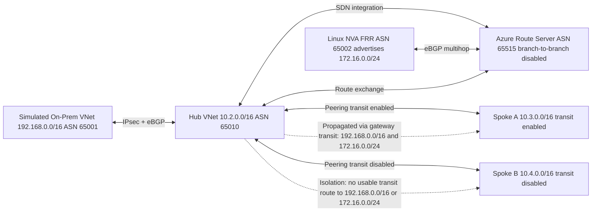

# Azure Route Server Lab: Detailed Problem Statement, Design, Architecture, and Expected Outcomes

## 1. Executive Summary

This lab is an end-to-end validation environment for Azure Route Server (ARS) in a hub-and-spoke topology with:

- A simulated on-premises branch connected over S2S IPsec + BGP
- A Linux NVA (FRR) peering with ARS and advertising a synthetic route
- Two spokes configured with different gateway-transit behavior

The lab is designed to answer one core question:

Can route propagation be strictly controlled so that only intended VNets learn and use remote/branch routes, while unintended branches remain isolated?

## 2. Issue in Hand

### Primary Issue Under Investigation

The routing control-plane can become difficult to reason about when ARS, VPN gateways, BGP, and VNet peering (with mixed transit settings) are combined.

The specific risk being tested is route leakage across branch boundaries, especially when:

- ARS learns routes from multiple branch domains (VPN branch and NVA branch)
- Only one spoke is intended to use remote gateway transit
- Another spoke must remain isolated from those propagated routes

In short, this lab validates whether route visibility and forwarding behavior match design intent, not just whether BGP sessions come up.

### Secondary Operational Risk

The documentation and runtime settings indicate a sensitive dependency around on-prem BGP peering address selection (for active-active VPN gateway instances). If the wrong peering IP is used in local network gateway configuration, BGP can remain in Connecting state and route exchange will be partial or absent.

This is not the architecture goal itself, but a critical setup risk that can invalidate test conclusions if not handled correctly.

## 3. Purpose of the Lab

This lab exists to provide a repeatable, Terraform-based validation framework for:

1. ARS BGP route learning from multiple peers
2. Controlled route distribution to spokes based on peering transit settings
3. Branch-to-branch isolation behavior when ARS branch-to-branch is disabled
4. Data-plane behavior that confirms control-plane expectations
5. Troubleshooting patterns for common ARS + VPN + NVA misconfiguration cases

## 4. Target Design Principles

The environment is intentionally built around positive and negative controls:

- Positive control: Spoke A should receive and use remote gateway-learned routes.
- Negative control: Spoke B should not receive usable remote gateway routes.

Design guardrails:

- ARS branch-to-branch traffic is disabled.
- Spoke A is transit-enabled (allow gateway transit + use remote gateways).
- Spoke B is transit-disabled.
- NVA advertises a synthetic prefix to test non-native branch route injection.

## 5. Architecture Overview

The dotted paths above represent expected route visibility outcomes at the spoke effective route tables. They describe control-plane propagation behavior, not direct ARS-to-spoke data-plane forwarding.

## 6. Logical Routing Domains and Behavior

### Domain A: On-Prem Branch Domain

- Prefix source: 192.168.0.0/16
- Advertised through on-prem VPN gateway ASN 65001
- Learned by hub VPN gateway and then available to transit-enabled spokes

### Domain B: NVA Branch Domain

- Prefix source: 172.16.0.0/24 (synthetic)
- Originated by FRR on NVA ASN 65002
- Learned by ARS through route server BGP connection

### Domain C: Spoke A Consumer Domain

- Should receive and use gateway-transit route propagation
- Serves as the expected route visibility baseline

### Domain D: Spoke B Isolated Domain

- Must not receive usable remote gateway transit paths
- Serves as the route isolation proof point

## 7. Component Responsibilities

- networking.tf: Creates hub, on-prem, and spoke VNets/subnets.
- gateway-routeserver.tf: Deploys hub and on-prem VPN gateways, ARS, and public IP dependencies.
- s2s-bgp.tf: Defines local network gateways and BGP-enabled bidirectional S2S connections.
- nva.tf: Creates Linux NVA, enables IP forwarding, installs FRR, and advertises synthetic route.
- peering.tf: Implements asymmetric transit policy between hub and each spoke.
- transit-udr.tf: Forces spoke-to-spoke traffic through NVA for transit testing.
- compute.tf: Deploys Windows test VMs and NSG rules for route/data-plane checks.

## 8. Why This Design Is Useful

This architecture tests multiple failure and leakage surfaces in one environment:

- BGP session health versus actual route propagation
- ARS learned-route behavior versus peering transit policy
- Route visibility versus route usability (presence with next hop None vs active forwarding)
- NVA-injected route containment with branch-to-branch disabled

It closely resembles real enterprise hub-and-spoke concerns while remaining deterministic and reproducible.

## 9. Validation Strategy

### Control Plane Checks

- S2S connection status is Connected.
- Hub gateway BGP peers are Connected.
- ARS has learned NVA synthetic route.
- Spoke A effective route table includes remote-gateway sourced prefixes.
- Spoke B effective route table does not include usable remote-gateway routes.

### Data Plane Checks

- Spoke A can reach expected on-prem targets (for allowed protocol/port).
- Spoke B cannot traverse to on-prem over transit-disabled path.
- Spoke-to-spoke traffic follows UDR path through NVA.

## 10. Expected Outcomes

If the lab is functioning as designed, the expected outcomes are:

1. Route propagation is policy-bound, not global.
2. Spoke A inherits intended branch routes through gateway transit.
3. Spoke B remains isolated from branch transit routes.
4. NVA synthetic route can be learned by ARS but does not leak into unintended branch domains when branch-to-branch is disabled.
5. Data-plane tests match control-plane expectations.

## 11. Success Criteria (Pass/Fail)

Pass the lab when all are true:

- Hub and on-prem BGP sessions are stable.
- ARS and NVA peering is established on both route server IPs.
- Spoke A shows expected active routes to branch prefixes.
- Spoke B does not show an active route path for branch prefixes.
- Reachability tests confirm A can traverse intended path, B cannot traverse isolated path.

Fail the lab when any routing outcome violates intended transit/isolation policy, even if tunnels and peers appear healthy.

## 12. Assumptions and Constraints

- Azure VPN gateways are active-active and expose multiple BGP peering addresses.
- Correct peering address selection is required for consistent BGP establishment.
- NSGs and OS firewall behavior can affect probe outcomes; route-plane and data-plane should be interpreted together.
- Route convergence timing can temporarily mask final behavior immediately after deployment.

## 13. Practical Value of This Exercise

This lab is not only a deployment exercise. It is a route-governance validation harness that helps teams:

- Prove non-leakage controls before production rollout
- Build confidence in ARS and transit policy behavior
- Create repeatable evidence for design reviews and security/network governance discussions
- Reduce risk in enterprise hub-and-spoke migrations where route segmentation is mandatory
