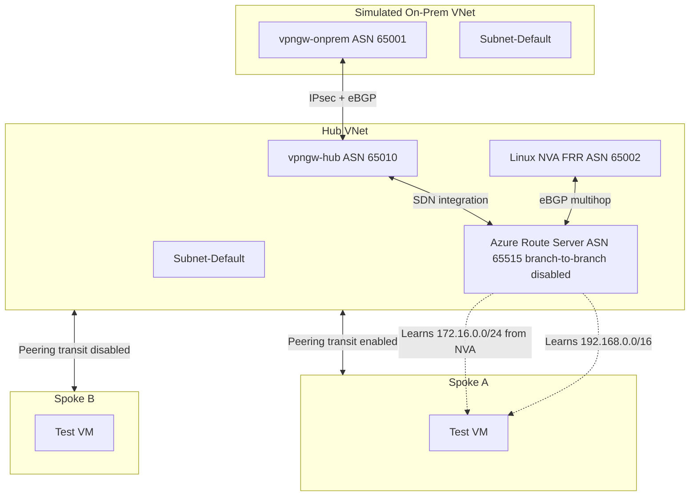

# Azure Route Server Route Leakage Lab

## Detailed Lab Analysis

For the full deep-dive document covering the issue statement, architecture rationale, design decisions, validation strategy, and expected outcomes, see [LAB-DETAILED-ANALYSIS.md](LAB-DETAILED-ANALYSIS.md).

## Quick Start

Use this minimal flow to deploy and run a first-pass validation.

1. Initialize Terraform

```bash
terraform init
```

1. Set lab values

```bash
cp terraform.tfvars.example terraform.tfvars
```

1. Validate and preview

```bash
terraform validate
terraform plan
```

1. Deploy

```bash
terraform apply -auto-approve
```

1. Quick route checks

```bash
az network vnet-gateway list-learned-routes \
  --resource-group rg-ars-end-to-end-lab \
  --name vpngw-hub

az network nic show-effective-route-table \
  --resource-group rg-ars-end-to-end-lab \
  --name nic-spoke-a-win22-1

az network nic show-effective-route-table \
  --resource-group rg-ars-end-to-end-lab \
  --name nic-spoke-b-win22-1
```

Expected first result:

- Spoke A should show remote-gateway learned routes.
- Spoke B should not show those transit routes.

## Purpose of This Lab

This lab validates route propagation and isolation behavior in a hub-and-spoke topology that uses:

- Azure Route Server (ARS)
- eBGP over VPN gateways between a simulated on-prem environment and Azure hub
- A Linux NVA running FRR that injects a synthetic route
- Two spokes with different gateway-transit settings to test route exposure boundaries

The main question is:

Can a route learned by Azure Route Server from one branch domain leak into places where it should not be visible?

In this lab, `branch_to_branch_traffic_enabled` is intentionally set to `false` on ARS to test leakage prevention.

## Design and Architecture

### High-Level Design

The environment contains five routing domains:

1. Simulated On-Premises VNet
2. Hub VNet
3. Spoke A VNet (transit-enabled)
4. Spoke B VNet (transit-disabled)
5. NVA route domain (FRR peering with ARS)

The intended behavior:

- Spoke A receives gateway-transit learned routes
- Spoke B stays isolated from gateway-transit learned routes
- ARS learns routes from on-prem and NVA, but branch-to-branch propagation is controlled by ARS policy

### Logical Topology



### Addressing Model (Current tfvars Values)

- Hub VNet: `10.2.0.0/16`
- Hub GatewaySubnet: `10.2.254.0/24`
- Hub RouteServerSubnet: `10.2.253.0/27`
- Hub NVA Subnet: `10.2.1.0/24`
- On-Prem VNet: `192.168.0.0/16`
- On-Prem GatewaySubnet: `192.168.254.0/24`
- Spoke A: `10.3.0.0/16`
- Spoke B: `10.4.0.0/16`
- NVA loop/source IP: `10.2.1.10`
- NVA advertised synthetic route: `172.16.0.0/24`

## Component Details

### 1) Core Networking

- Resource group for all lab resources
- Hub, on-prem, and spoke VNets with dedicated subnets
- Route Server and VPN gateway mandatory subnets (`RouteServerSubnet`, `GatewaySubnet`)

Why it exists:

- Establishes discrete routing domains so route movement can be observed and verified

### 2) VPN Gateways (Hub and Simulated On-Prem)

- Active-active capable VPN gateway deployment model
- BGP enabled on both gateways
- S2S IPsec connections between hubs via local network gateways

Why it exists:

- Creates a realistic branch edge and route exchange channel through BGP

### 3) Azure Route Server

- Deployed in hub RouteServerSubnet
- `branch_to_branch_traffic_enabled = false`

Why it exists:

- Central BGP route-learning point in the hub
- Enforces branch-to-branch control behavior under test

### 4) Linux NVA (Ubuntu + FRR)

- NIC with IP forwarding enabled
- Cloud-init bootstraps FRR and BGP peering to ARS instances
- Installs a blackhole route for `172.16.0.0/24` so FRR can originate and advertise it

Why it exists:

- Injects a controlled synthetic route to test whether ARS leaks it across domains

### 5) Spokes and Peerings

- Spoke A peering:
  - `allow_gateway_transit = true` on hub side
  - `use_remote_gateways = true` on spoke side
- Spoke B peering:
  - `allow_gateway_transit = false` on hub side
  - `use_remote_gateways = false` on spoke side

Why it exists:

- Provides a positive control path (Spoke A should learn) and negative control path (Spoke B should not learn)

### 6) Test VMs and NSG Rules

- Windows Server VMs in both spokes
- NSG allows ICMP and iperf3 (TCP/UDP 5201) between spoke ranges

Why it exists:

- Supports both route-plane and data-plane testing from endpoint perspective

## Lab Objective and Validation Hypothesis

### Objective

Validate that ARS route propagation follows intended policy boundaries and does not leak branch routes unexpectedly.

### Hypothesis

Given:

- ARS branch-to-branch disabled
- Spoke A transit enabled
- Spoke B transit disabled

Expected:

- Spoke A sees and can use routes learned via gateway transit (`192.168.0.0/16`, `172.16.0.0/24`)
- Spoke B does not receive those remote-gateway learned routes
- On-prem does not unexpectedly receive NVA synthetic routes due to branch-to-branch isolation policy

## Deployment Workflow

1. Initialize and validate

```bash
terraform init
terraform validate
```

1. Review change set

```bash
terraform plan
```

1. Apply

```bash
terraform apply -auto-approve
```

## Testing Methodology for Route Leakage

Testing is split into three layers.

### A) Control Plane Validation

1. Confirm BGP sessions are up:

- Hub VPN gateway to on-prem VPN gateway
- NVA FRR peers to ARS (`.4` and `.5` in RouteServerSubnet)

1. Confirm route inventory:

- ARS has learned `172.16.0.0/24` from NVA
- ARS has learned `192.168.0.0/16` from simulated on-prem

1. Confirm effective routes at NIC/subnet level:

- Spoke A NIC effective routes should include expected learned prefixes
- Spoke B NIC effective routes should not include remote-gateway learned prefixes

### B) Data Plane Validation

From Spoke A VM:

- Trace route and ping toward representative on-prem destination range
- Validate traffic path uses expected next hop behavior

From Spoke B VM:

- Attempt same probes
- Confirm unreachable or no route where transit is intentionally disabled

Optional throughput check:

- Use iperf3 TCP/UDP between spoke test hosts to validate baseline connectivity independent of remote-gateway propagation

### C) Leakage-Specific Assertions

Use this matrix to decide pass/fail:

| Assertion                                                          | Expected Result |
| ------------------------------------------------------------------ | ----------------|
| ARS learns `172.16.0.0/24` from NVA                                | Yes             |
| Spoke A receives NVA synthetic route                               | Yes             |
| Spoke B receives NVA synthetic route                               | No              |
| On-prem receives unexpected NVA route due to branch-to-branch path | No              |
| Route visibility matches peering transit flags                     | Yes             |

## Suggested Verification Commands

### Terraform state and outputs

```bash
terraform state list
terraform output
```

### Azure CLI examples

```bash
az network vnet-gateway list-learned-routes \
  --resource-group rg-ars-end-to-end-lab \
  --name vpngw-hub

az network nic show-effective-route-table \
  --resource-group rg-ars-end-to-end-lab \
  --name nic-spoke-a-win22-1

az network nic show-effective-route-table \
  --resource-group rg-ars-end-to-end-lab \
  --name nic-spoke-b-win22-1
```

Adjust resource names if your tfvars values differ.

## Common Pitfalls Observed in This Lab

1. Existing Azure resource not in state

- Symptom: resource already exists and must be imported
- Fix: `terraform import <address> <resource-id>`

1. Counted resources referenced without index

- Symptom: missing resource instance key
- Fix: use explicit index, for example `resource[0]`

1. Imported gateway peering address not yet populated

- Symptom: invalid index when reading `default_addresses[0]`
- Fix: use a temporary override variable for on-prem BGP peering address, then return to dynamic lookup after convergence

1. Non-AZ VPN SKU

- Symptom: `NonAzSkusNotAllowedForVPNGateway`
- Fix: use `VpnGw*AZ` SKUs

## Conclusion

This lab is designed to prove route boundary correctness in a mixed ARS + VPN + NVA topology.

When deployed and tested as described, it demonstrates that:

- ARS can learn and distribute routes from both simulated on-prem and NVA peers
- Gateway transit settings on hub-spoke peerings directly control which spokes inherit remote-gateway learned routes
- With branch-to-branch disabled, synthetic branch routes should not leak across unintended branch domains

In short, the lab provides a repeatable, infrastructure-as-code framework to validate route leakage controls and to troubleshoot BGP propagation behavior before production rollout.
