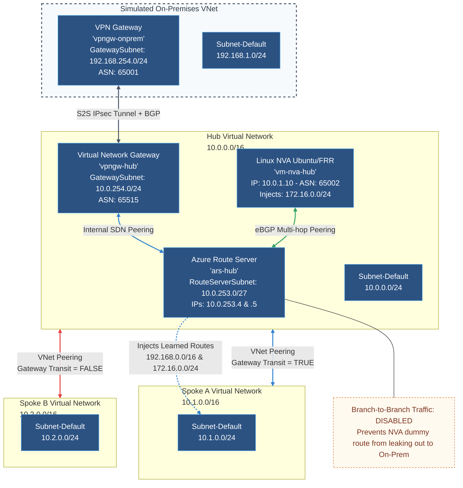

# Lab Design

```mermaid
graph TD
    %% Define Styles & Palette
    classDef hubStyle fill:#1a365d,stroke:#2b6cb0,stroke-width:2px,color:#ffffff;
    classDef spokeAStyle fill:#ebf8ff,stroke:#3182ce,stroke-width:2px,color:#2d3748;
    classDef spokeBStyle fill:#fff5f5,stroke:#e53e3e,stroke-width:2px,color:#2d3748;
    classDef extStyle fill:#f7fafc,stroke:#4a5568,stroke-width:2px,stroke-dasharray: 5 5,color:#2d3748;
    classDef compStyle fill:#2c5282,stroke:#63b3ed,stroke-width:1px,color:#ffffff;
    
    %% Simulated On-Premises Block
    subgraph OnPremVNet [Simulated On-Premises VNet <br/> 192.168.0.0/16]
        OnPremGW[VPN Gateway<br/>'vpngw-onprem'<br/>GatewaySubnet: 192.168.254.0/24<br/>ASN: 65001]
        OnPremDefault[Subnet-Default<br/>192.168.1.0/24]
    end
    class OnPremVNet extStyle;
    class OnPremGW,OnPremDefault compStyle;

    %% Hub VNet Block
    subgraph HubVNet [Hub Virtual Network <br/> 10.0.0.0/16]
        ARS[Azure Route Server<br/>'ars-hub'<br/>RouteServerSubnet: 10.0.253.0/27<br/>IPs: 10.0.253.4 & .5]
        VPNGW[Virtual Network Gateway<br/>'vpngw-hub'<br/>GatewaySubnet: 10.0.254.0/24<br/>ASN: 65515]
        NVA[Linux NVA Ubuntu/FRR<br/>'vm-nva-hub'<br/>IP: 10.0.1.10 - ASN: 65002<br/>Injects: 172.16.0.0/24]
        HubDefault[Subnet-Default<br/>10.0.0.0/24]
    end
    class HubVNet hubStyle;
    class ARS,VPNGW,NVA,HubDefault compStyle;

    %% Spoke A Block
    subgraph SpokeAVNet [Spoke A Virtual Network <br/> 10.1.0.0/16]
        SpokeADefault[Subnet-Default<br/>10.1.0.0/24]
    end
    class SpokeAVNet spokeAStyle;
    class SpokeADefault compStyle;

    %% Spoke B Block
    subgraph SpokeBVNet [Spoke B Virtual Network <br/> 10.2.0.0/16]
        SpokeBDefault[Subnet-Default<br/>10.2.0.0/24]
    end
    class SpokeBVNet spokeBStyle;
    class SpokeBDefault compStyle;

    %% Physical & Logical Connections
    OnPremGW <-->|S2S IPsec Tunnel + BGP| VPNGW
    VPNGW <-->|Internal SDN Peering| ARS
    NVA <-->|eBGP Multi-hop Peering| ARS

    %% Peering A Connections
    HubVNet <-->|VNet Peering<br/>Gateway Transit = TRUE| SpokeAVNet
    ARS -.->|Injects Learned Routes<br/>192.168.0.0/16 & 172.16.0.0/24| SpokeADefault

    %% Peering B Connections
    HubVNet <-->|VNet Peering<br/>Gateway Transit = FALSE| SpokeBVNet
    
    %% Visual Indicator of Leakage Check Boundary
    LeakBoundary[Branch-to-Branch Traffic: DISABLED<br/>Prevents NVA dummy route from leaking out to On-Prem]
    ARS --- LeakBoundary
    style LeakBoundary fill:#fffaf0,stroke:#dd6b20,stroke-width:1px,color:#7b341e,stroke-dasharray: 3 3;

    %% Link Styling
    linkStyle 0 stroke:#4a5568,stroke-width:2px;
    linkStyle 1 stroke:#3182ce,stroke-width:2px;
    linkStyle 2 stroke:#38a169,stroke-width:2px;
    linkStyle 3 stroke:#3182ce,stroke-width:2px;
    linkStyle 4 stroke:#3182ce,stroke-width:2px,stroke-dasharray: 3 3;
    linkStyle 5 stroke:#e53e3e,stroke-width:2px;
```
