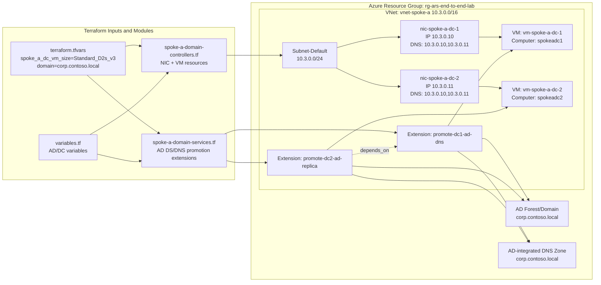
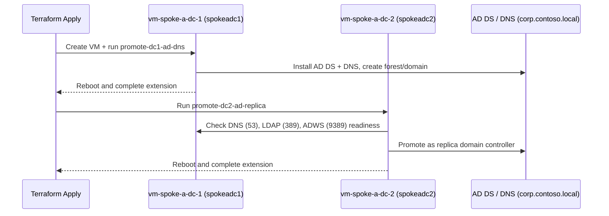
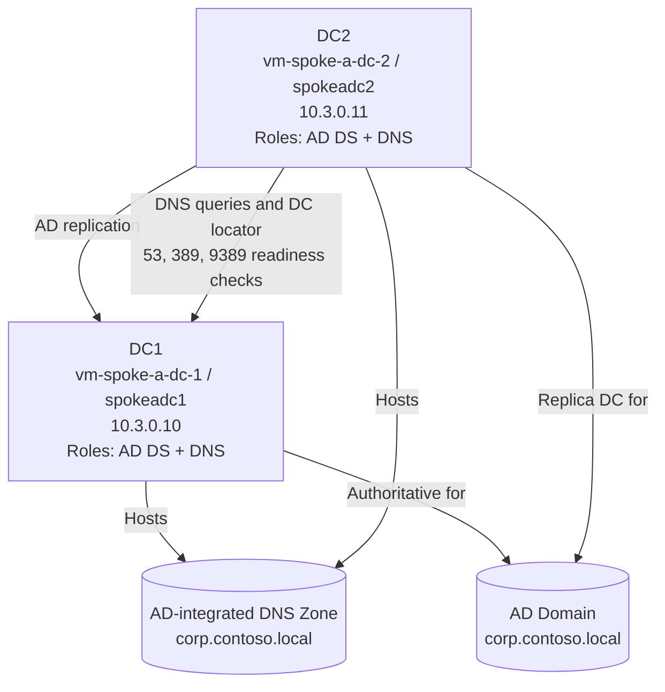
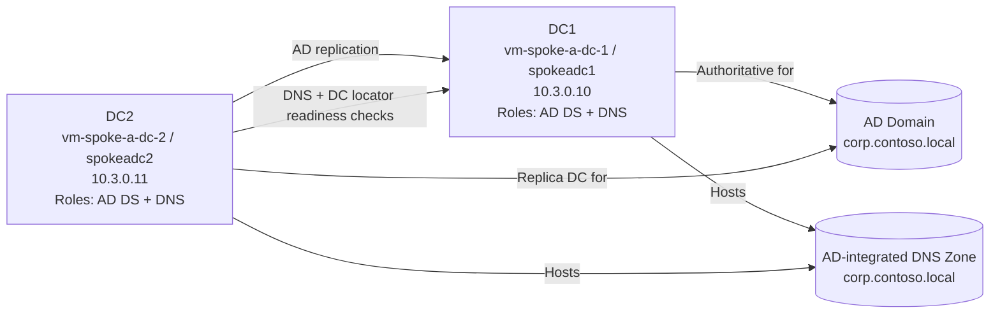

# Domain Controller Architecture Design

## Purpose
This design summarizes how domain controllers are implemented in the lab codebase, where AD DS and DNS are installed, and how the promotion flow is orchestrated.

## Where Domain Controllers Are Implemented

### Terraform implementation locations
- VM and NIC provisioning: [spoke-a-domain-controllers.tf](spoke-a-domain-controllers.tf)
- AD DS and DNS promotion scripts + VM extensions: [spoke-a-domain-services.tf](spoke-a-domain-services.tf)
- Spoke A subnet hosting DCs: [networking.tf](networking.tf)
- AD/DC input variables: [variables.tf](variables.tf)
- Active environment values (domain name, VM size, subnet CIDR): [terraform.tfvars](terraform.tfvars)

### Documentation locations reviewed
- Setup and operations runbook: [docs/addc_dns.md](docs/addc_dns.md)
- Troubleshooting and remediation history: [docs/troubleshooting_onprem_rdp_connection.md](docs/troubleshooting_onprem_rdp_connection.md)

## Key Design Findings From Code

1. Two dedicated Windows Server domain controller VMs are created in Spoke A:
- DC1: vm-spoke-a-dc-1 / spokeadc1 / 10.3.0.10
- DC2: vm-spoke-a-dc-2 / spokeadc2 / 10.3.0.11

2. Both NICs use static IPs and explicitly point DNS to both DC addresses:
- 10.3.0.10
- 10.3.0.11

3. AD DS deployment is extension-driven:
- DC1 extension (promote-dc1-ad-dns) creates forest/domain and DNS.
- DC2 extension (promote-dc2-ad-replica) waits for DNS/LDAP/ADWS readiness and then promotes as replica.

4. Domain and AD settings are parameterized:
- Domain: corp.contoso.local
- NetBIOS: CORP
- DSRM password: provided via variable

## Architecture Diagram

## Promotion Sequence

## Validation Traceability

The docs confirm this architecture and operational behavior:
- [docs/addc_dns.md](docs/addc_dns.md): setup procedure, validation commands, and expected outcomes.
- [docs/troubleshooting_onprem_rdp_connection.md](docs/troubleshooting_onprem_rdp_connection.md): quota remediation, extension state import handling, and final replication success.

## Notes

- The implementation intentionally uses static IP assignment for both DCs to keep DNS and AD service discovery deterministic.
- Extension ordering is deterministic: DC2 promotion waits for DC1 promotion completion and readiness checks.

## Active directory design

This view focuses only on Active Directory domain controllers and DNS service relationships.

### Active directory design (left-to-right variant)

